# Assignment 1

* Do the following lessons from OWASP WebGoat:
	* Introduction: How to work with WebGoat
		* 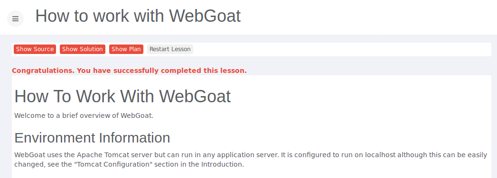
	* General: HTTP Basics
		* 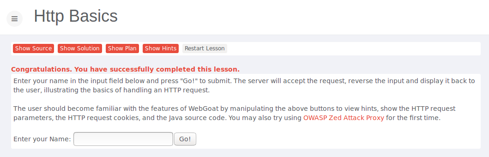
	* Code Quality: Discover clues in the HTML
		* 	
	* Insecure Storage: Encoding Basics:
		* 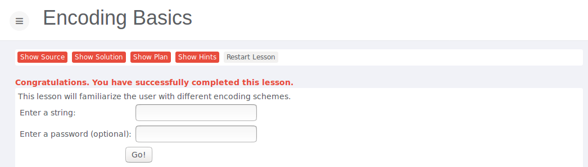
	* Paramter Tampering: Bypass HTML Field Restrictions
		* 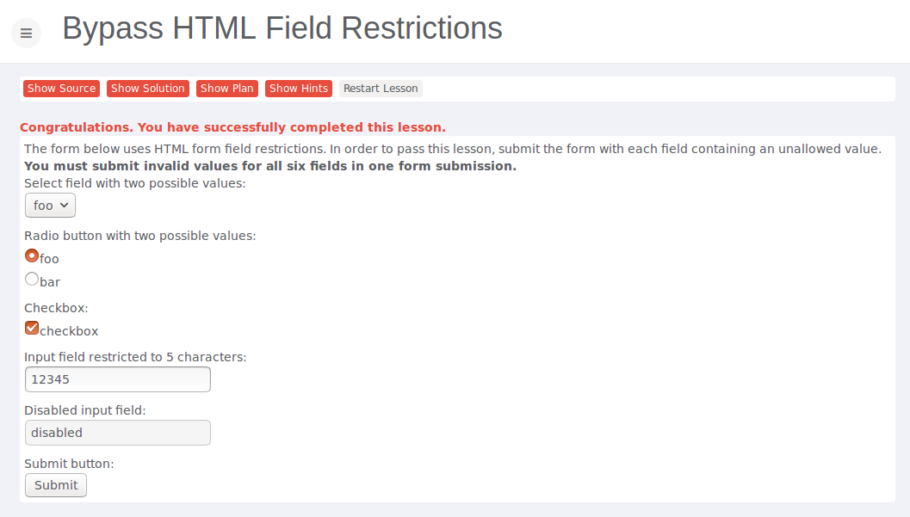
	* Paramter Tampering: Exploit Hidden Fields
		* 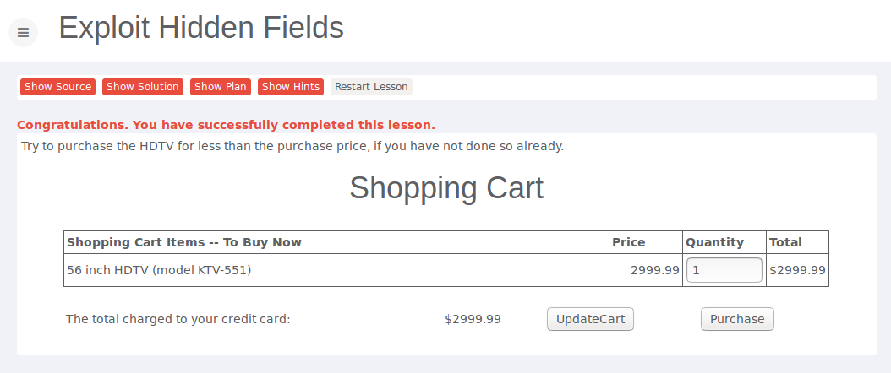					

* In lesson "Insecure Storage - Encoding Basics" of WebGoat, what is the name of the encoding for the string field (the one after "Enter a string") in the HTTP request?

	* If we take the following string as input without the quotation marks "string&test", we'll get the following encoded string "string%26test". 
	* 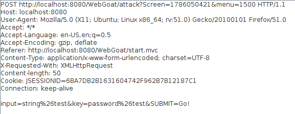
	* Therefore, URL encoding is used.

* In lesson "Insecure Storage - Encoding Basics" of WebGoat, what is the name of the encoding which is used for the (optional) password? (Hint: use your proxy to inspect the characters which you enter as inputs and their corresponding encoding in the HTTP request)

	* Given the image above, the optional password field is using the same encoding as the "Enter a string"-field. The ID of "Enter a string"-field is called "input" and the ID of the password-field is called "key". Both fields are using URL encoding.

* Inspect the HTTP traffic which is generated by the GET and POST actions on ../demo/demo_get_post.html}. Say an attacker eavesdrops your network traffic (i.e. a Man-in-the-Middle attack.) Does a GET request provide better protection than a POST request, or vice versa, or is there no difference?

	* There is no difference in terms of protection against eavesdropping. There is no special encoding which would ensure protection. An attacker can read the sensitive data from the query string or from the body part of the HTTP request. The only difference between GET and POST requests is their purpose and behaviour. GET requests should only be used to request a ressource or retrieve data. GET should be used for idempotent operations, i.e. operations without side effects on the server. The drawback of a GET request is their visibile query string in the URL. A GET request should not be used for sensitive data because a GET request can be cached, bookmarked, has a maximum length and ends up in browser history. POST should be used to submit a request and has its parameters in its body. POST requests are never cached, cannot be bookmarked and do not end up in browser history. It also has no restrictions on length which emphasizes its purpose on submitting and not retrieving data.

	* Simple GET Request
		* 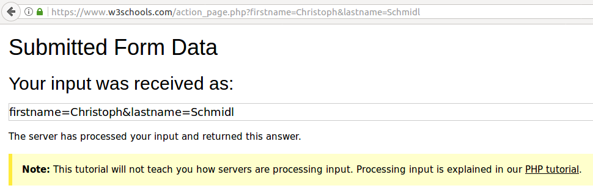
		* 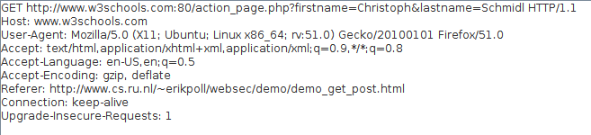
	* Simple POST Request
		* 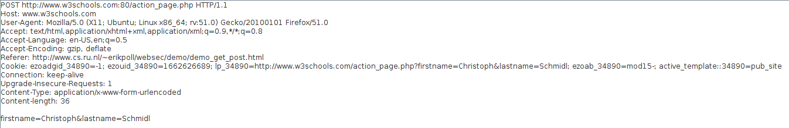	

* Does a hidden field provide better protection than a non-hidden field, or vice versa, or is there no difference?

	* A hidden field does not provide any additional protection that a normal input field would not provide in terms of protection against eavesdropping. A hidden field just indicates that it should not be visibile to the user when the page gets rendered by the browser. Most of the time developers place a fixed value into hidden fields because it makes their lifes easier when processing certain requests on the server. Just because a hidden field does not get rendered by the browser it does not mean that a user cannot change the value of a hidden field. By using the HTML-inspection function of modern browsers it is pretty easy to change the value of such a hidden field. Paramter/Data Tampering can be applied with ease.

	* Hidden field GET Request
		* 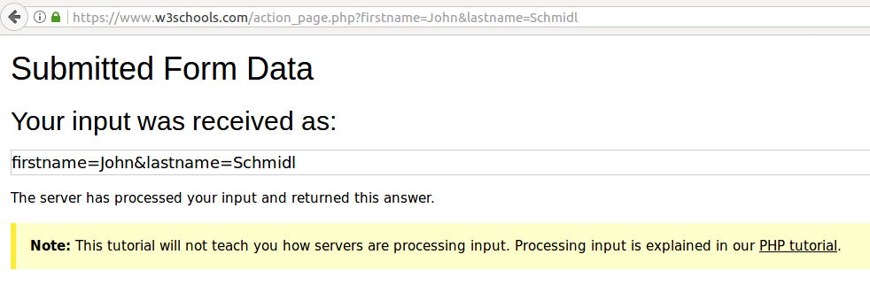
		* 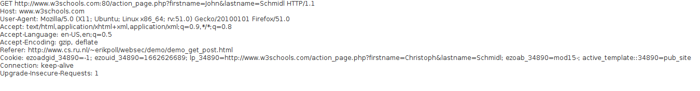
	* Hidden field POST Request
		* 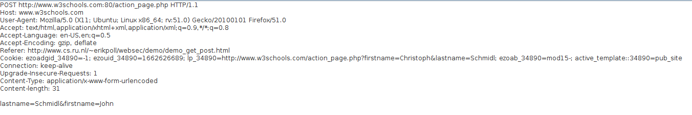	