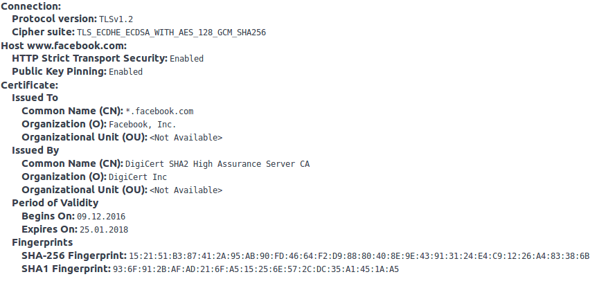

# Assignment 2

* Do the following two lessons in WebGoat (you do not have to submit any notes regarding these exercises to blackboard):

	* Session Management Flaws - Hijack a Session
		* 
		*  Session hijacking, sometimes also known as cookie hijacking is the exploitation of a valid computer session—sometimes also called a session key—to gain unauthorized access to information or services in a computer system. In particular, it is used to refer to the theft of a magic cookie used to authenticate a user to a remote server.
		* In this particular lesson the value of the cookie named "WEAKID" can be bruteforced by using a tool like JHijack. To find a value to start with you can use the SessionID Analysis Tab of WebScarab. You do not know the identity of the user's session you are going to hijack.
	* Session Management Flaws - Session Fixation
		* 
		* Session fixation attacks attempt to exploit the vulnerability of a system that allows one person to fixate (find or set) another person's session identifier. Most session fixation attacks are web based, and most rely on session identifiers being accepted from URLs (query string) or POST data.
		* Straightforward scenario:
			* Mallory has determined that http://unsafe.example.com/ accepts any session identifier, accepts session identifiers from query strings and has no security validation. http://unsafe.example.com/ is thus not secure.
			* Mallory sends Alice an e-mail: "Hey, check this out, there is a cool new account summary feature on our bank, http://unsafe.example.com/?SID=I_WILL_KNOW_THE_SID". Mallory is trying to fixate the SID to I_WILL_KNOW_THE_SID.
			* Alice is interested and visits http://unsafe.example.com/?SID=I_WILL_KNOW_THE_SID. The usual log-on screen pops up, and Alice logs on.
			* Mallory visits http://unsafe.example.com/?SID=I_WILL_KNOW_THE_SID and now has unlimited access to Alice's account.
		* Attack using server generated SID
			* Mallory visits http://vulnerable.example.com/ and checks which SID is returned. For example, the server may respond: Set-Cookie: SID=0D6441FEA4496C2.
			* Mallory is now able to send Alice an e-mail: "Check out this new cool feature on our bank, http://vulnerable.example.com/?SID=0D6441FEA4496C2."
			* Alice logs on, with fixated session identifier SID=0D6441FEA4496C2.
			* Mallory visits http://vulnerable.example.com/?SID=0D6441FEA4496C2 and now has unlimited access to Alice's account.

* Inspect 5 websites for which you got login credentials
	* Do these website use HSTS (HTTP Strict Transport Security)?
		* What is HSTS and why is it important? HSTS stands for HTTP Strict Transport Security and tells the browser to only use HTTPS when communicating with the server and not relying on an insecure HTTP connection. HSTS is a web security policy mechanism which helps to protect websites against protocol downgrade attacks and cookie hijacking. The HSTS policy is communicated by the server to the user agent via an HTTP response header field named "Strict-Transport-Security". HSTS policy specifies a period of time which the user agent should only access the server in a secure fashion. Facebook introduced this policy to their website in 2013: https://www.facebook.com/notes/facebook-engineering/secure-browsing-by-default/10151590414803920/ Before that time an attacker was able to intercept a request and serve a different page, including a fake login one (assumed he was trying to visit a subdomain of facebook (https://null-byte.wonderhowto.com/how-to/bypass-facebooks-hsts-0169414/)). Below you can find a https response from facebook when you're logged in.
		* 
		* The Security Tab of Firefox' Network Tab also shows that HSTS is enabled by Facebook.
		* 
	* Does the session ID cookie of these websites use Secure and/or HttpOnly?
		* Security of cookies is an important subject. HttpOnly and secure flags can be used to make the cookies more secure. When a secure flag is used, then the cookie will only be sent over HTTPS, which is HTTP over SSL/TLS. When this is the case, the attacker eavesdropping on the communication channel from the browser to the server will not be able to read the cookie (HTTPS provides authentication, data integrity and confidentiality). 
		* When HttpOnly flag is used, JavaScript will not be able to read the cookie in case of XSS exploitation. A combination of HTTP TRACE method and XSS might be used to bypass HttpOnly flag – this combination is cross-site tracing (XST) attack. It turns out that modern browsers block the HTTP TRACE method in XMLHttpRequest. However, it’s still important to know how XST works. If the attacker finds another way of sending HTTP TRACE, then he can bypass an HttpOnly flag when he understands how XST works. (taken from: http://resources.infosecinstitute.com/securing-cookies-httponly-secure-flags/)
		* Facebook implemented this feature to their site in 2013 together with their HSTS feature (https://www.facebook.com/notes/facebook-engineering/secure-browsing-by-default/10151590414803920/). They say "The secure attribute for authentication cookies. By default, web browsers send all cookies, including authentication cookies, on insecure requests. We’ve implemented the secure attribute in the Set-Cookie header, which instructs the browser to only send these cookies on https requests so the cookies won't be visible on the network if you happen to visit an insecure link to Facebook."
		* Facebook stores its login session information in different cookies (http://hackwhiz.com/2015/01/facebook-cookie-stealing-and-session-hijacking/). But the important ones are secured by the httpOnly and Secure flag.

* Make a table of these websites and their support for HSTS, the name of the cookie and the usage of Secure and HttpOnly for that cookie.

| **Website**  | **HSTS**  | **Cookie Name**  | **Secure**  | **HttpOnly** |
|---|---|---|---|---|
| facebook.com  |  yes | multiple cookies (c_user, xs, sb)  | yes, yes, yes  | no, yes, yes  |
| mail.ru.nl  | no  | cadata  | yes  | yes  |
| linkedin.com  | no  | li_at  | yes  | yes  |
| github.com  | yes  | _gh_sess  | yes  | yes  |
| gmx.net  | yes  | 905a7a5991a00898953878290a55d118  | yes  | yes  |	

	