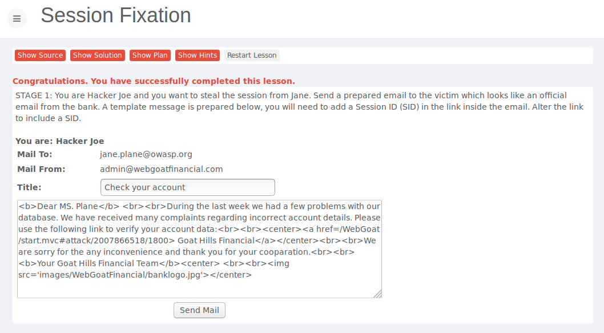
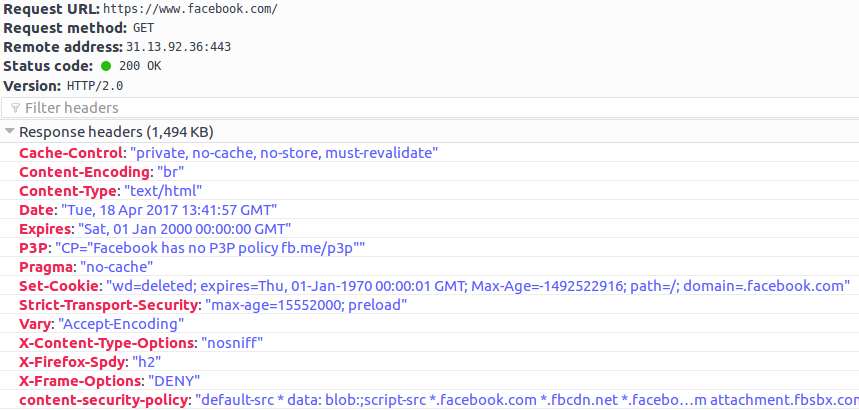

# Assignment 2

* Do the following two lessons in WebGoat (you do not have to submit any notes regarding these exercises to blackboard):

	* Session Management Flaws - Hijack a Session
		* 
	* Session Management Flaws - Session Fixation
		* 

* Inspect 5 websites for which you got login credentials
	* Do these website use HSTS (HTTP Strict Transport Security)?
		* What is HSTS and why is it important? HSTS stands for HTTP Strict Transport Security and tells the browser to only use HTTPS when communicating with the server and not relying on an insecure HTTP connection. HSTS is a web security policy mechanism which helps to protect websites against protocol downgrade attacks and cookie hijacking. The HSTS policy is communicated by the server to the user agent via an HTTP response header field named "Strict-Transport-Security". HSTS policy specifies a period of time which the user agent should only access the server in a secure fashion. Facebook introduced this policy to their website in 2013: https://www.facebook.com/notes/facebook-engineering/secure-browsing-by-default/10151590414803920/ Before that time an attacker was able to intercept a request and serve a different page, including a fake login one (assumed he was trying to visit a subdomain of facebook (https://null-byte.wonderhowto.com/how-to/bypass-facebooks-hsts-0169414/)). Below you can find a https response from facebook when you're logged in.
		* 
	* Does the session ID cookie of these websites use Secure and/or HttpOnly?

* Make a table of these websites and their support for HSTS, the name of the cookie and the usage of Secure and HttpOnly for that cookie.

	