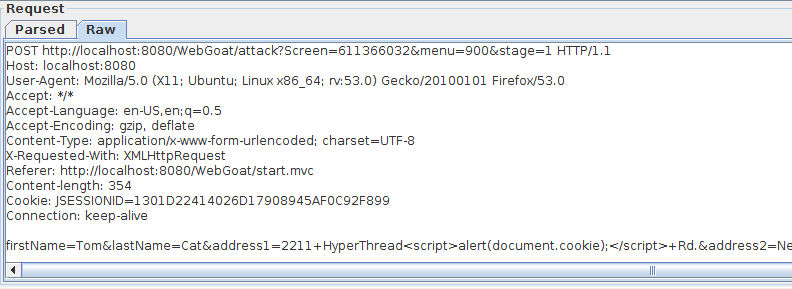
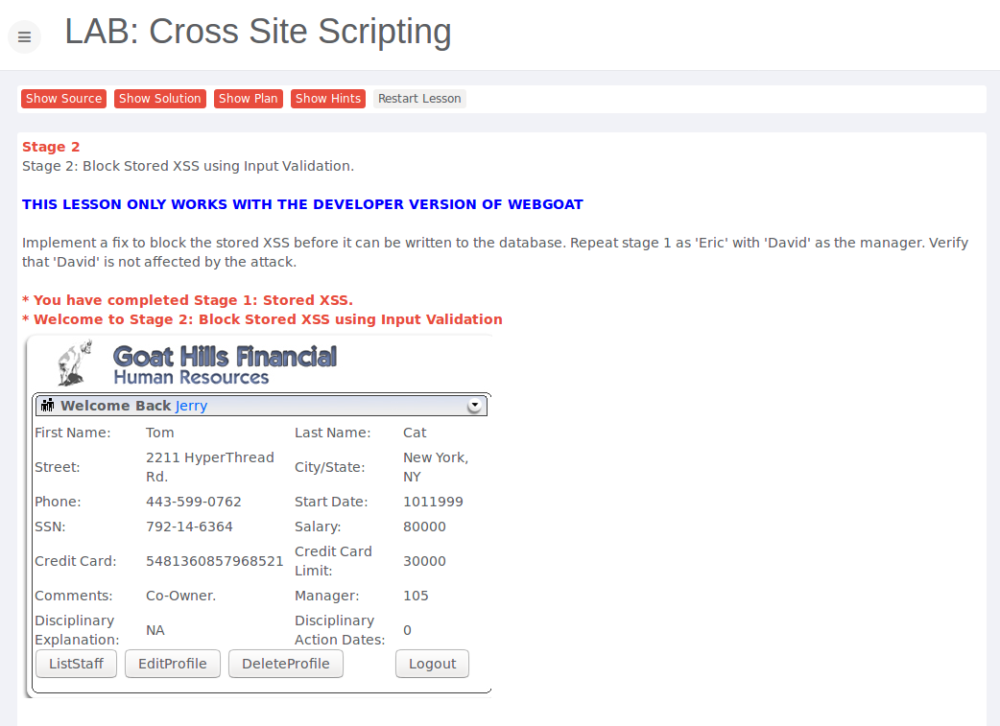
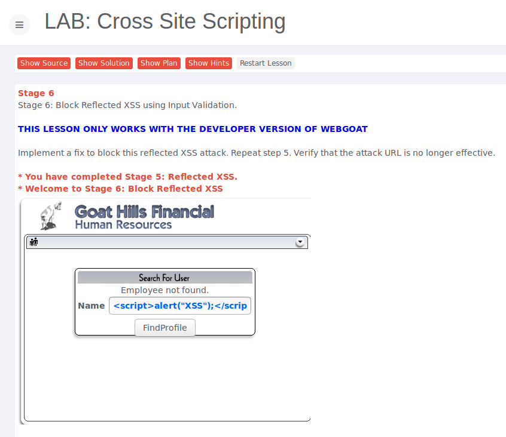

# Assignment 4

* Do the following lessons in WebGoat (you do not have to submit any notes regarding these exercises to blackboard):

	* Cross-Site Scripting (XSS) - Stored XSS attacks

		* 
		* 

	* Cross-Site Scripting (XSS) - Reflected XSS attacks

		* 	

* Do the following three exercises on http://websecurity.cs.ru.nl/
	
	* Level 3
	* Level 4
	* Level 5
	* Level 6

		

	