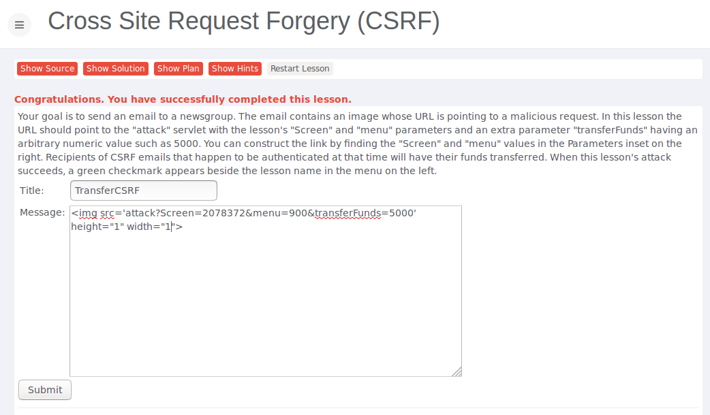
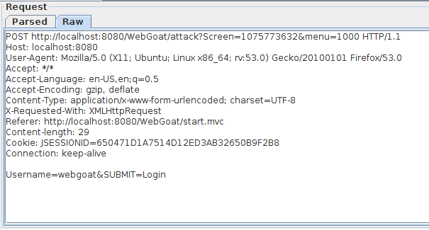
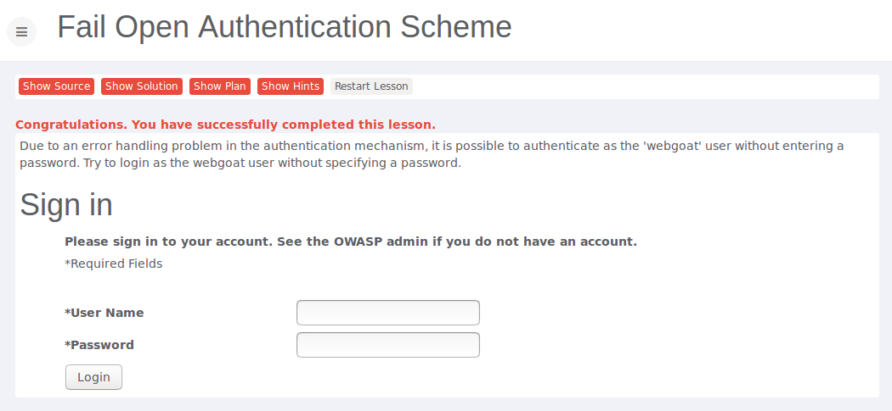
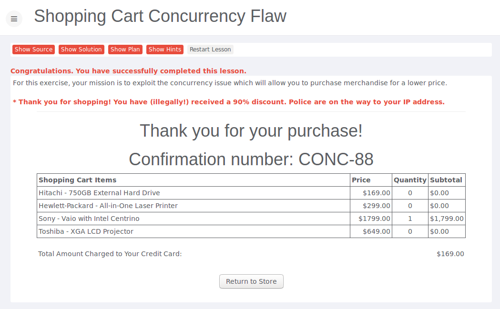

# Assignment 5

* Do the following lessons in WebGoat (you do not have to submit any notes regarding these exercises to blackboard):

	* Cross-Site Scripting (XSS) - Cross Site Request Forgery (CSRF)

		* 


	* Improper Error Handling - Fail Open Authentication Scheme

		* Just strip the password parameters from the post request
		* 
		* 

	* Concurrency - Shopping Cart Concurrency Flaw

		* 

* Do the following four exercises on http://websecurity.cs.ru.nl/
	
	* Level 7

		* There is a bug in the strcmp funtion which cannot handle arrays as input and therefore returns 0 which gives you the solution. Inspect the html source and change the name of the input field "pass" to "pass[]".
		* See also: https://www.owasp.org/images/6/6b/PHPMagicTricks-TypeJuggling.pdf
		* Solution: YjU1NWY4MzBi

	* Level 8
	
		* Change the referer to localhost
		* Solution: YTQzMzI5MWRl

	* Level 9
	
		* Do a post request with some testdata for the input fields. Take a look at this post request in WebScarab and change the cookie value "LoggedIn=false" to "LoggedIn=true".
		* When you fire the manual request in WebScarab, you should be able to see the password.
		* Solution: OGRkNDRmMDU3	

	* Level 10
		
		* Just reverse the encryption steps
		* ```
			function reverseHexdigest() {
			  var hexdigest = "447b5974467c6f5f600a4261";
			  
			  var deximalRepresentation = [68, 123, 89, 116, 70, 124, 111, 95 , 96, 10, 66, 97];
			  var reversedShuffled = shuffle([6, 1, 5, 10, 8, 2, 0, 7,3 ,4 ,11 ,9], deximalRepresentation);
			  var reversedXor = xor([32, 44, 38, 41, 46, 35, 47, 39, 46, 44, 48, 57], reversedShuffled);


			  console.log(String.fromCharCode.apply(null, reversedXor));  
			};

		* Solution: OWZkNzkxZjQ3	


		


	